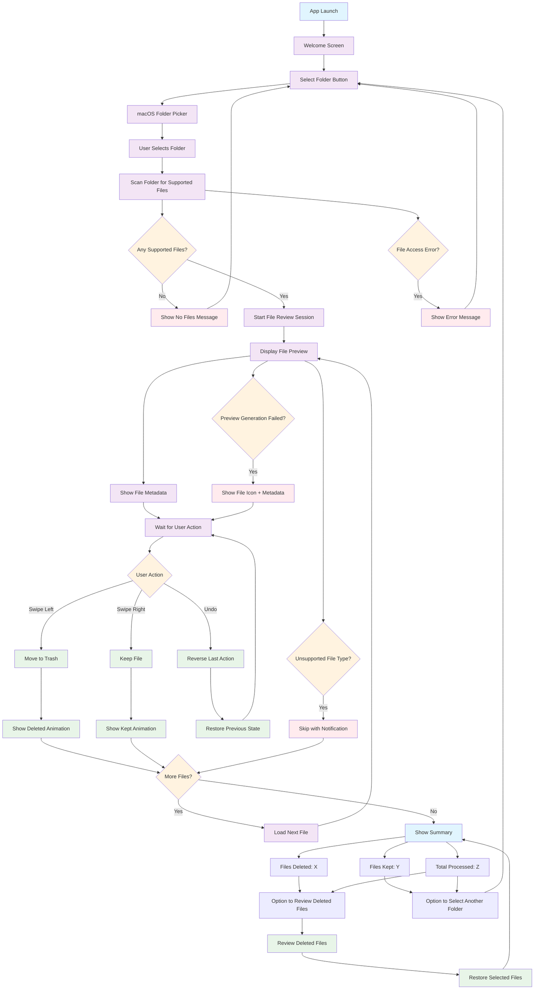

# QuickToss User Flow Diagram

## Gesture Mapping
- **Swipe Left (←)**: Delete file (move to Trash)
- **Swipe Right (→)**: Keep file (skip)
- **Tap**: Show more details (optional)
- **Undo**: Cmd+Z or dedicated button

## Visual Feedback
- **Swipe Left**: Red background, "DELETE" text
- **Swipe Right**: Green background, "KEEP" text
- **Loading**: Spinner or progress indicator
- **Completion**: Checkmark animation

## File Type Support
- **Images**: JPEG, PNG, GIF, HEIC, WebP
- **Documents**: PDF, TXT, RTF
- **Future**: Videos, Office docs, etc.
